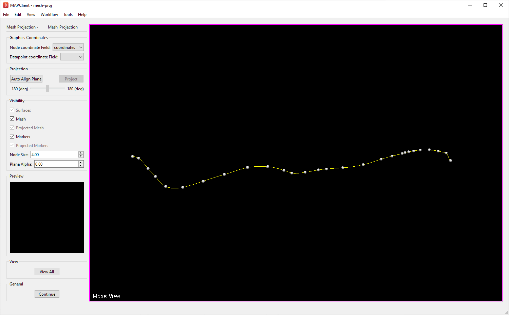
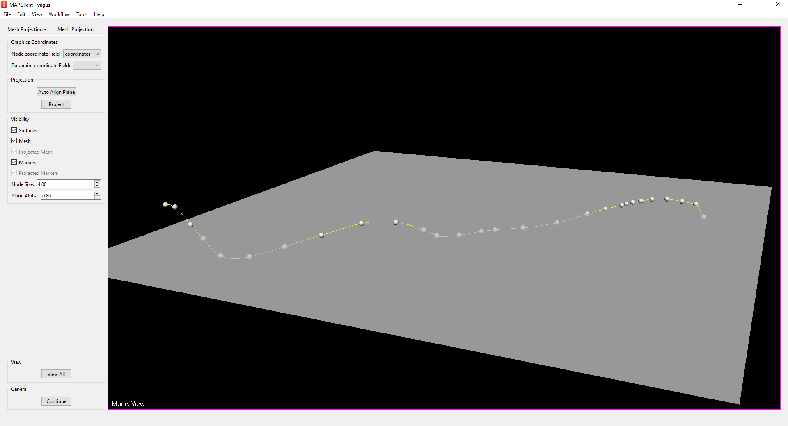
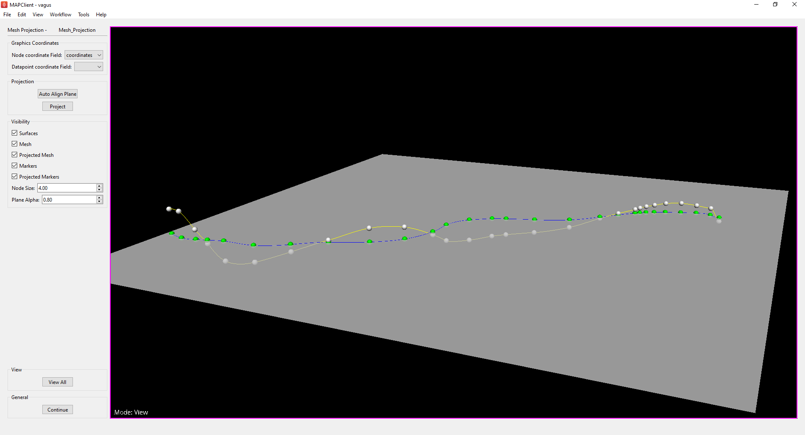
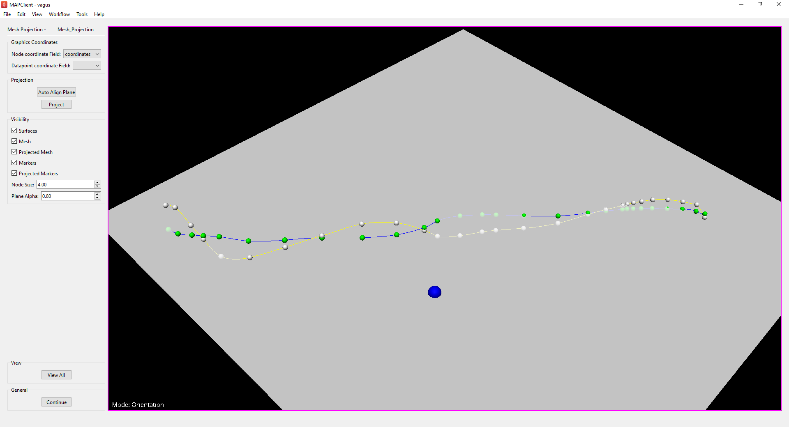
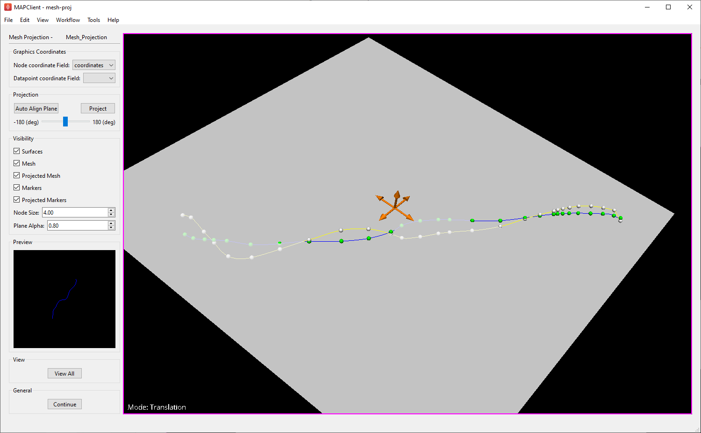

Mesh Projection Step
====================

Overview
--------

The **Mesh Projection** step is an interactive plugin for the MAP-Client.

This plugin takes a `Zinc` compatible mesh EX file as an input, and provides an interactive GUI allowing the user to create a projection
of the mesh onto a plane. It utilises the `cmlibs.widgets` `Orientation` handler and `FixedAxisTranslation` handler to help the user define
and visualise the plane used for the projection. The **Mesh Projection** step outputs a new `Zinc` EX file defining the projected mesh.

Specification
-------------

Information on this plugin's specifications is available :ref:`here <mcp-meshprojection-specification>`.

Configuration
-------------

Information on this plugin's configuration is available :ref:`here <mcp-meshprojection-configuration>`.

Workflow Setup
--------------

Information on setting up a workflow with this plugin can be found :ref:`here <mcp-meshprojection-workflow-setup>`.

Instructions
------------

When the plugin loads for the first time you should see something like the image displayed in :numref:`fig-mesh-projection-initial`.

.. _fig-mesh-projection-initial:

   **Mesh Projection** user interface just after loading.

The coordinate fields used for the mesh and marker (data-point) definitions are determined automatically, but can be changed using the
combo-boxes in the `Graphics Coordinates` section if required. If the mesh EX file input does not contain any data-points, the
`Datapoint Coordinate Field` combo-box will be empty, and no data-points will be displayed.

Visibility
^^^^^^^^^^

There are a number of check-boxes in the `Visibility` section of the user interface (UI). Initially, only `Mesh` and `Markers` (data-points) are enabled -
as these are the only graphics that have been created at this point. The check-boxes for the `Surfaces` (projection plane), `Projected Mesh`
and `Projected Markers` will be automatically enabled once the associated graphics have been initialised.

The size of the mesh nodes and data-points can be adjusted with the `Node Size` spin box. If the points appear too small or if they aren't
initially visible, try increasing this value.

The `Plane Alpha` value can also be adjusted to control the opacity of the projection plane, which may aid the user in the plane
manipulation and projection process.

Projection
^^^^^^^^^^

The scene viewer currently has four modes: `View`, `Selection`, `Orientation` and `Translation` - indicated by the text in the bottom left
of the view window. `View` mode is activated by default and allows the user to change the view-point of the scene using the mouse.
`Selection` mode can be activated by holding the **S** key on the keyboard. The user can select a single graphics item at a time or drag a
selection box over everything they wish to select.

`Orientation` and `Translation` mode are used to manipulate the orientation and position of the projection plane (using the corresponding
`Orientation` and `FixedAxisTranslation` `CMLibs` scene handlers). Both modes are disabled until the user generates an initial projection
plane. To first generate a projection plane, the user must click `Auto Align Plane` in the `Projection` section of the UI; this will
automatically create a projection plane and visualise a bounded segment of that plane in the scene viewer.

.. _fig-mesh-projection-plane:

   **Mesh Projection** step with auto-generated projection plane.

At this point, we should have a valid projection plane - as in :numref:`this figure <fig-mesh-projection-plane>` - and we can project our input mesh onto this plane using
the `Project` button in the `Projection` section.

.. _fig-mesh-projection-projection:

   **Mesh Projection** step with mesh projected onto plane.

Any markers (data-points) associated with the input mesh will also be projected onto the plane.

Plane Manipulation
^^^^^^^^^^^^^^^^^^

If the users wishes to adjust the orientation of the plane, they may activate the `Orientation` handler by holding the **O** key on the
keyboard. While active, the `Orientation` handler will allow the user to rotate the projection plane around a rotation point by clicking
and dragging the mouse within the scene viewer. The rotation point is indicated by a blue sphere. This will be positioned at the centre
of the plane by default, but may be selected and dragged to any position on the projection plane.

.. _fig-mesh-projection-orientation:

   **Mesh Projection** step with `Orientation` handler active.

Similarly, the position of the projection plane may be adjusted with the `FixedAxisTranslation` handler. This handler can be activated
using the **T** key on the keyboard. While active, a set of translation arrows will be displayed in the centre of the projection plane.
There are two arrows for each Cartesian axis and these arrows can be dragged to translate the plane in the direction they specify.

.. _fig-mesh-projection-translation:

   **Mesh Projection** step with `FixedAxisTranslation` handler active.

The user will need to press the `Project` button again after making any adjustments to the plane orientation or position.

For more information on the `Orientation` and `FixedAxisTranslation` handlers, please refer to the
`CMLibs Widgets documentation <https://abi-mapping-tools.readthedocs.io/en/stable/cmlibs.widgets/docs/index.html>`_
for these classes - found under `Handlers`.

Finishing
^^^^^^^^^

Clicking the `Continue` button will output the mesh projection as well as any projected markers (data-points) to a `Zinc` EXF file and will
execute any additional workflow steps connected to the **Mesh Projection** step.
