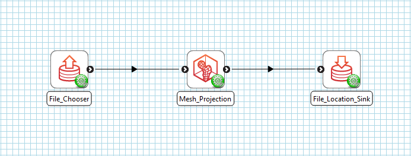

.. _mcp-meshprojection-workflow-setup:

Workflow Setup
--------------

To setup a mesh projection workflow, add a **File Chooser** step (or another step that provides a `Zinc` mesh EX file) and a
**Mesh Projection** step to the workflow area. Edit the **File Chooser** step configuration to specify the `Zinc` EX file that
defines the mesh to be projected. Once this step has been configured, connect its output port to the input port of the
**Mesh Projection** step - as in :ref:`Fig. 1 <fig-mesh-projection-workflow>`. The mesh projection step will be configured by
default as it doesn't have any configuration settings to be set. What you connect the **Mesh Projection** step output port to
depends on your objective. In :ref:`Fig. 1 <fig-mesh-projection-workflow>` we have connected the output port to a
**File Location Sink** step - allowing us to define a local directory where the output file will be saved.

.. _fig-mesh-projection-workflow:

   **Mesh Projection** workflow connections.

Once we have the workflow set up, save it and click the `Execute` button to start the **Mesh Projection** GUI.
